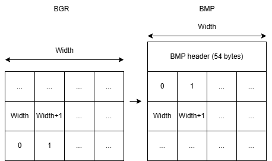

# How to реализовать converter

## Как выглядит BMP file

BMP file - простейший формат представления изображений. В файле находится 54 байта служебной информации, после которой идет массив пикселей. На каждый пиксель приходится 3 байта цвета - RGB.

### Формат заголовка bmp

Заголовок делится на две части - Bitmap Header (14 байт) и Bitmap Info (40 байт).

**Bitmap Header:**
||||
|---|---|---|
|Название|Размер|Описание|
|Magic num|1 байт|  Magic number 'B' |
|Magic num|1 байт|  Magic number 'M' |
|File length|4 байта| Общая длина файла |
|Reserved|4 байта| Отступ, заполнить нулями |
|Header length|4 байта| Общая длина заголовка |

**Bitmap Info:**
||||
|---|---|---|
|Название|Размер|Описание|
|Size|4 байта|Размер Bitmap Header|
|Width|4 байта|Ширина изображения|
|Height|4 байта|Высота изображения|
|Planes|2 байта|Кол-во слоёв изображения (по умолчанию 1)|
|Bit Count|2 байта|Количество битов на один пиксель|
|Compression|4 байта|Степень сжатия (по умолчанию 0)|
|Size image|4 байта|Размер массива пикселей в байтах|
|X pels per meter|4 байта|Точность изображения по ширине (базово 0)|
|Y pels per meter|4 байта|Точность изображения по ширине (базово 0)|
|Clr Used|4 байта|Параметры таблицы цветов (можно выставить 0)|
|Clr Important|4 байта|Параметры таблицы цветов (можно выставить 0)|

### Конвертация массива пикселей

Для того, чтобы сделать из массива BGR массив BMP достаточно в обратном порядке переставить строки (в BGR они подаются в обратном порядке).

