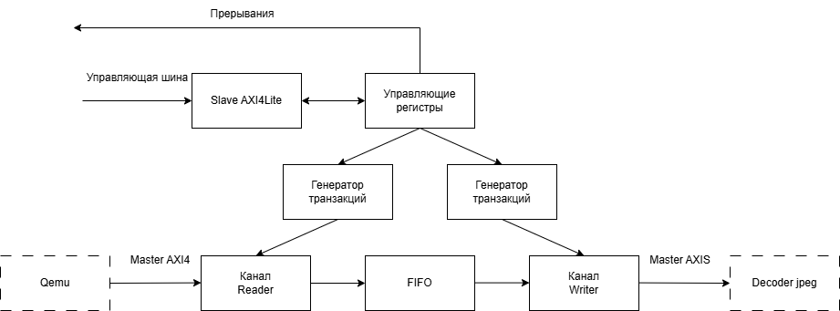

# Описание DMA

*DMA* - аппаратный блок, предназначенный для прямого доступа памяти. В нашей системе выполняет функцию передатчика данных из памяти в потоковый канал JPEG, что позволяет не передавать эти данные вручную. Такой подход помогает разгрузить процессор и уменьшить количество отправляемых транзакций.

## Поддерживаемая функциональность блока

+ Прерывания по окончанию выполнения.
+ 2D трансферы с возможностью отступа. (Есть два измерения размеров транзакции - Line, Line count)

## Особенности реализации

+ Длина одной транзакции - не более 1024 байт.

## Программная модель

DMA обладает двумя каналами - Reader и Writer. Для каждого из них есть соответствующий набор управляющих регистров. Каналы могут работать как раздельно так и одновременно, позволяя ускорить передачу данных.

1. Установить маску прерывания [Если хотите получать сообщение о завершении работы по прерыванию, а не по опросу].
2. Установить базовый адрес данных, которые мы хотим передать на JPEG.
3. Установить количество передаваемых данных:
    + Установить длину одной транзакции (сколько чисел будет вычитывать и передавать в djpeg за один раз - максимальное значение 256).
    + Установить количество таких транзакций.
4. Выставить регистр начала передачи.
5. Дождаться конца транзакций при помощи механизма прерываний или опроса соответствующего регистра.

## Карта регистров 

|Название регистра| Смещение |Название бита| Номер бита| Режим доступа | Значение сброса|Описание| 
|---|---|---|---|---|---|---|
|Control|0x0|||||Регистр для управлением состояния DMA.|
|||Writer start|0|rw|0|1: для запуска канала записи|
|||Reader start|1|rw|0|1: для запуска канала чтения|
|||Writer sync off|2|rw|0|1: для выключения синхронизации записи (не требуется).|
|||Reader sync off|3|rw|0|1: для выключения синхронизации чтения (не требуется).|
|||Writer loop|4|rw|0|1: для запуска следующей транзакции после завершения.|
|||Reader loop|5|rw|0|1: для запуска следующей транзакции после завершения.|
|||-|31:06|-|0|Не используется|
|Status|0x4|||||Состояние выполнения транзакций.|
|||Writer busy|0|r|0|1 если блок запущен в режиме записи|
|||Reader busy|1|r|0|1 если блок запущен в режиме чтения|
|||-|31:02|-|0|Не используется|
|Interrupt mask|0x8|||||Маска прерываний|
|||Writer mask|0|rw|0|1 для включения прерывания по окончанию записи.|
|||Reader mask|1|rw|0|1 для включения прерывания по окончанию чтения.|
|||-|31:02|-|0|Не используется|
|Interrupt status|0xС|||||Статус прерывания.|
|||Writer interrupt|1|r|0|1 если прерывания записи было отправлено.|
|||Reader interrupt|2|r|0|1 если прерывания чтения было отправлено.|
|||-|31:02|-|0|Не используется|
|Reader start address|0x10|Start address|31:00|rw|0|Стартовый адрес для чтения.|
|Reader line length|0x14|Line length|31:00|rw|0|Длина одной транзакции в 32-битный словах.|
|Reader line count|0x18|Line count|31:00|rw|0|Количество транзакций.|
|Reader stride|0x1C|Stride|31:00|rw|0|Отступ по адресам между транзакциями.|
|Writer start address|0x20|Start address|31:00|rw|0|Стартовый адрес для записи.|
|Writer line length|0x24|Line length|31:00|rw|0|Длина одной транзакции в 32-битный словах.|
|Writer line count|0x28|Line count|31:00|rw|0|Количество транзакций.|
|Writer stride|0x2C|Stride|31:00|rw|0|Отступ по адресам между транзакциями.|
|Version|0x30|Version|31:00|r|1|Версия DMA.|
|Configuration|0x34|Configuration|31:00|r|-|Конфигурация портов DMA.|