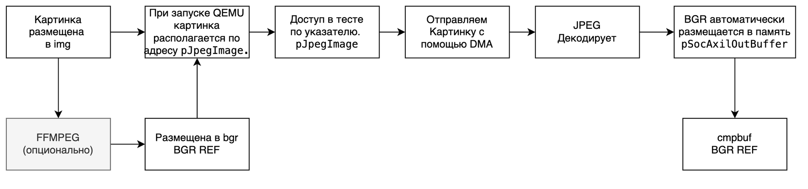
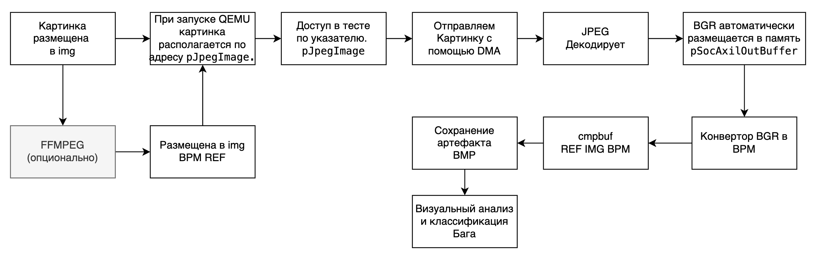

# End-to-end guideline

Для достижения максимального покрытия и поиска ошибок на сломанных дизайнах необходимо реализовать E2E сценарий тестирования. Такой сценарий максимально приближен к реальному сценарию использования и подразумевает получение выходных данных (изображения в формате bmp или bgr). В конце выходные данные необходимо сравнить с эталонными, чтобы удостовериться в правильности работы системы.

## Типовой E2E сценарий 

Для нашей СнК типовой сценарий выглядит следующим образом:
1. Сконфигурировать JPEG decoder (снять сигнал сброса, установить адрес для записи выходной картинки) (Подробнее в [JPEG](JPEG.MD)).
2. Сконфигурировать DMA на считывание картинки из памяти QEMU и передачу её в djpeg (Подробнее в [DMA](DMA.MD)).
3. Запустить DMA.
4. Дождаться конца декодирования картинки (вернется она по указателю pSocAxilOutBuffer)
5. Побайтово сравнить полученную кратинку с эталонной (Которая указана при запуске теста). Для этого рекомендуется использовать функцию `int cmpbuf(int* src, int* dst, int size)` из *src/mem_access.c*.

Резюмируя, можно представить этот сценарий графически

## А есть не типовой сценарий?

В теории, можно использовать сценарий выше и для других картинок, поднимая покрытие. Тогда советуем научиться пользоваться утилитой ffmpeg для конвертации новых найденных картинок в формат BGR...

ЛИБО

Написать конвертер в BMP! Для дополнительного обоснования использования этого варианта можно для начала прочитать [главу из README про конвертер](../README.md#разработка-конвертера-день-2). Тогда сценарий теста E2E легким движением руки превращается в следующий:

Более подробно почитать про то, как реализовать конвертер можно почитать в [CONVERTER](CONVERTER.MD)
