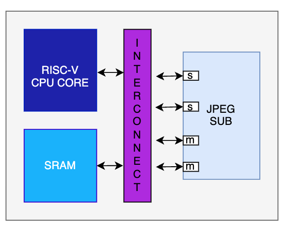
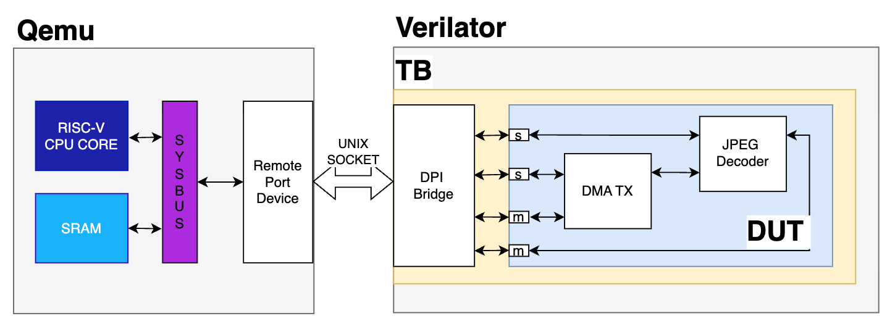

# Описание СнК 
## Состав СнК
Система на кристалле включает в свой состав следюющие блоки:
- RV32IMAC_Ziscr- 32х разрядный CPU с архитектурой RISC-V с поддерживаемые расширениям - I, M, A, C, Ziscr.
- SRAM памятью.
- Подсистема декодирования видео "JPEG SUB"
    - [DMA контроллер.](DMA.MD)
    - [JPEG декодер.](JPEG.MD)
- AXI interconnect
### Карта памяти СнК:
| Block | Adresses |Description|
| ------ | ------ | ------ |
| SRAM   |   0x80000000-0x90000000     |Память |
| JPEG SUB (DMA)|   0x28000000-0x280000FF    | DMA контроллер|
| JPEG SUB (DEC)|   0x28001000-0x280010FF     |JPEG декодер |			
	 

### Функциональная Схема

### Верификационное окружение
Для проверки предлагаемого дизайна подготовлено верификационное окружение разработанное с использование подхода совместной симуляции. Подробнее о подходе можно узнать из статьи [на хабре](https://habr.com/ru/companies/yadro/articles/885854/).

Окружение менять не нужно,  но полезно будет разобраться, как дружат между собой функциональный симулятор QEMU и RTL симулятор Verilator. 

Вам доступны предсобранный QEMU и Verilator. Поэтому верификацию нужно проводить в парадигме черного ящика - разработать тесты и проанализировать результаты их выполнения.